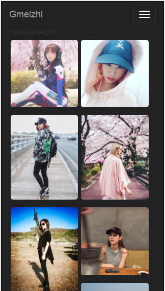

## Welcome to my blog  ----GakkiXIaoT
#工作小记
* 2017-04-18 
    *  昨天把jq升级到了最新版本，于是代码各种插件报错（jquery的dialog，还有些日历控件等等），查看jquery-issues发现jq发布了帮你向下兼容低版本插件* [jquery-migrate](https://github.com/jquery/jquery/issues/3157) 

# react练习
## Gmeizhi1
刚刚开始学习react一个练手项目 

 
本项目运用了： 
1.es6 
2.react-router@4.0 
3.Waterfall瀑布流react插件(PS:由于我接口的数据跟这个插件要求的数据结构不一样，所以稍微改了下这个插件) 
4.react-bootstrap 

# 感谢
* [妹纸.gank.io](https://github.com/drakeet/Meizhi)提供的妹纸接口
